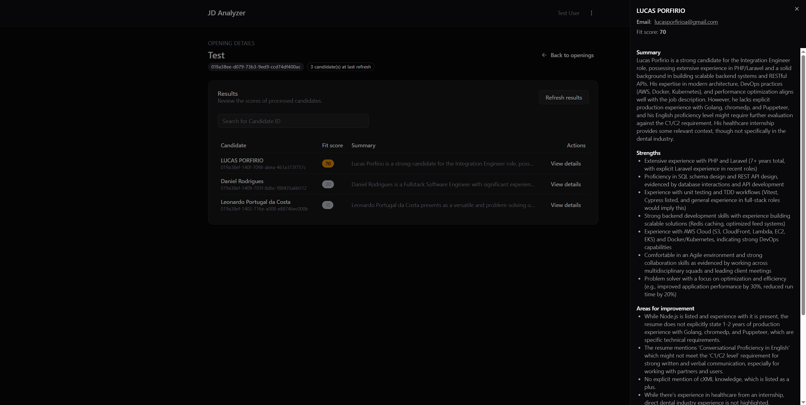

JD Analyzer (React)

An admin-facing React app for analyzing job openings and candidate resumes. It lets you:
- Create job descriptions by uploading a PDF and a title
- Upload candidate resumes (PDF) to an opening
- See processed candidates with fit score, brief summary, and details
- Filter by Candidate ID and refresh results
- Navigate across a simple, protected dashboard

The app consumes a backend API (configurable via `VITE_API_URL`) for authentication, job description creation, resume upload, and candidate results.

Quick Links
- Dev server: `pnpm dev`
- Build: `pnpm build` and `pnpm preview`
- Tests: `pnpm test`
- Lint/format: `pnpm lint`, `pnpm lint:fix`, `pnpm prettier`, `pnpm prettier:fix`

Tech Stack
- React 19 + React Router
- TypeScript + Vite
- Tailwind CSS
- Axios for HTTP
- Zod for env validation
- Vitest + Testing Library for tests

Getting Started
1) Prerequisites
- Node.js 18+ and pnpm installed
- A running backend that exposes the endpoints used by this app

2) Configure environment
- Copy `.env.example` to `.env` and adjust the API URL:
  - `VITE_API_URL=http://localhost:8000` (or your backend URL)

3) Install dependencies
- `pnpm install`

4) Start the app
- `pnpm dev`
- Open the printed local URL in your browser

5) Build and preview
- `pnpm build`
- `pnpm preview`

Authentication
- On first load without a token, the app redirects to `/login`.
- Login calls `POST /auth/login` and stores the returned JWT.
- The app hydrates user info via `GET /auth/me` and attaches `Authorization: Bearer <token>` on requests.
- A `401` response clears the token and redirects back to `/login`.

Core Flows
- Create opening
  - From “Job Descriptions”, click “Add opening”, enter a title and upload a PDF JD.
  - Backend: `POST /jds` with `title` and `job_description` (FormData).

- Upload resumes
  - From an opening, click “Add candidates” and select one or more PDF files.
  - Per-opening upload limit is 20 resumes (see `RESUME_UPLOAD_LIMIT`). Files must be PDF.
  - Backend: `POST /jds/:jdId/resumes` with `resumes[]` (FormData).

- View results
  - Open an opening to see candidates with: Candidate ID, fit score badge, and summary.
  - Use the Candidate ID search input to filter the table.
  - Click “View details” for strengths, areas for improvement, and evidence in a side sheet.
  - Click “Refresh results” to re-fetch latest data.

Project Structure (high level)
- `src/app.tsx` – Router and providers
- `src/lib/api` – Axios client and API calls
- `src/features/job-descriptions/*` – Pages, hooks, and UI for openings/candidates
- `src/components/ui/*` – UI primitives

Available Scripts
- `pnpm dev` – Start Vite dev server
- `pnpm build` – Type-check and build for production
- `pnpm preview` – Preview production build
- `pnpm test` – Run vitest suite
- `pnpm lint` / `pnpm lint:fix` – ESLint
- `pnpm prettier` / `pnpm prettier:fix` – Prettier

Environment Variables
- `VITE_API_URL` – Base URL for the backend API. Required.

Backend API (expected)
- `POST /auth/login` – Authenticate and return `{ token, user }`
- `GET /auth/me` – Return authenticated user
- `GET /jds` – List job descriptions `{ jd_id, title, candidate_count }[]`
- `POST /jds` – Create a job description (FormData: `title`, `job_description`)
- `POST /jds/:jdId/resumes` – Upload candidate resumes (FormData: `resumes[]`)

Known Limits & Notes
- Resume uploads are PDF-only and limited to 20 per opening.
- Candidate search filters by Candidate ID only.
- Some content (summaries/details) may arrive asynchronously based on backend processing.

Planned Improvements
Below are the items noted to improve the app; keeping them here helps guide next iterations.
- React Query (TanStack Query):
  - Normalize data fetching/state, caching, refetch, loading/error boundaries, and optimistic updates.
- Pagination:
  - Paginate job descriptions and candidates; expose page size and navigation.
- Better search:
  - Expand beyond Candidate ID to include name/email, fit score range, and free-text across summary.
- Ordering/sorting:
  - Sort by fit score, candidate name, updated time; remember user preference.
- Better state management:
  - Consolidate view state and cross-page derived state using lightweight stores or React Context where appropriate.

